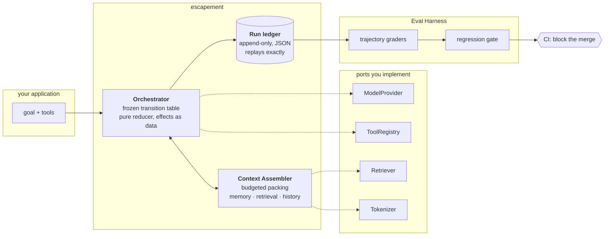
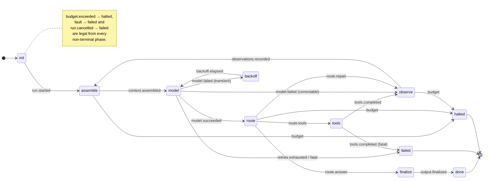
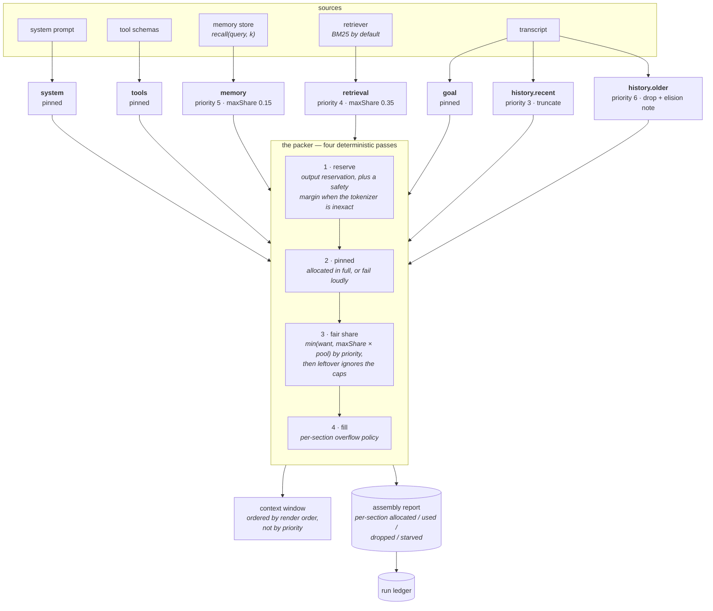
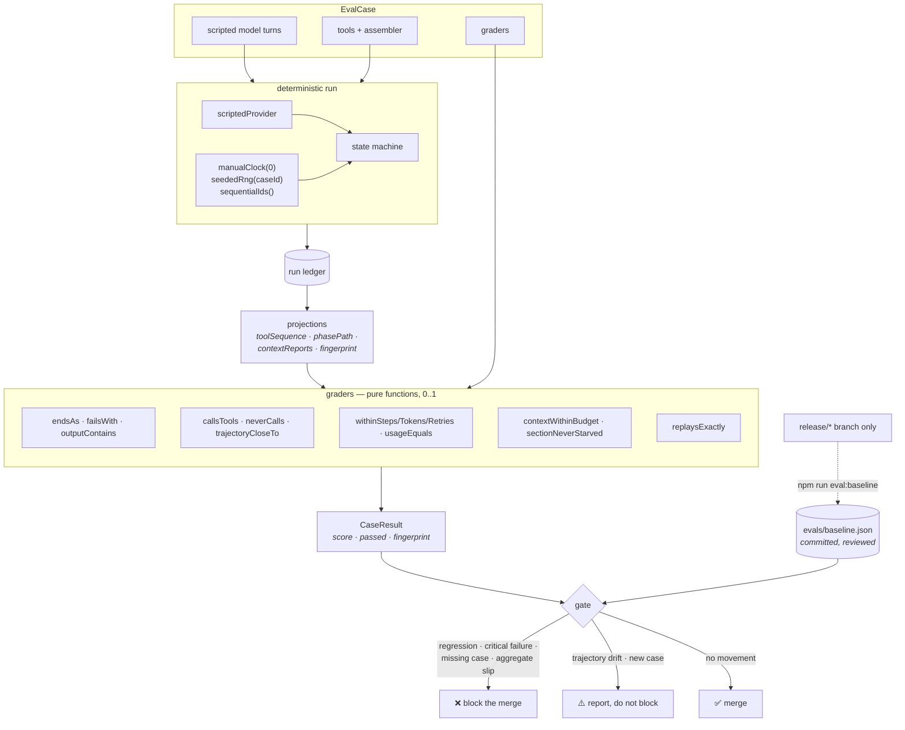

# Escapement

> An escapement is the part of a clock that turns continuous, unruly energy into
> discrete, countable ticks. This one does that to agents.

**Deterministic agent orchestration.** A hand-written state machine, a
token-budgeted context assembler, and an eval harness that grades whole
trajectories and blocks regressions in CI.

Zero runtime dependencies. No LangChain. Every run replays exactly.

```bash
npm install escapement
```

---

## Why

Three things are true of most agent code, and all three are fixable:

1. **You cannot reproduce a run.** Wall-clock timestamps, random ids and hidden
   retries mean the same inputs never produce the same trace twice, so nothing
   downstream can diff it.
2. **You cannot bound a run.** The step limit is one `if` inside a `while` loop
   that a refactor can move, and the context window overflows whenever a tool
   returns something large.
3. **You cannot tell when it got worse.** The output is sampled text. Comparing
   it to a reference answer catches almost nothing, and misses the run that got
   the right answer after four wrong tool calls.

Escapement is three components that fix those in order.



---

## Quickstart

```ts
import { run, createRegistry, tool, createAssembler, bm25Retriever } from "escapement";

const tools = createRegistry([
  tool(
    "search",
    "Search the docs.",
    { type: "object", properties: { q: { type: "string" } }, required: ["q"] },
    (args) => index.query(String(args.q)),
    { readOnly: true },   // declares: safe to run concurrently, safe to retry
  ),
]);

const { outcome, ledger } = await run({
  goal: "What does an escapement do?",
  provider: myModelProvider,          // ~10 lines around your SDK of choice
  tools,
  assembler: createAssembler({
    budget: { total: 128_000, reserveForOutput: 4_000 },
    systemPrompt: "You are a precise research assistant.",
    retrieval: { retriever: bm25Retriever(docs) },
  }),
  config: { budget: { maxSteps: 8, maxToolCalls: 20 } },
});

outcome.status;              // "completed" | "failed" | "halted"
ledger.usage.modelCalls;     // ≤ 8, guaranteed by the reducer, not by the loop
replay(ledger).ok;           // true — the run reproduces exactly
```

---

## 1. The Orchestrator

A frozen transition table, a pure reducer, and a runtime that makes no
decisions.



The full generated table is [`docs/STATE-MACHINE.md`](docs/STATE-MACHINE.md) —
produced from the same object the reducer asserts against, with a CI check that
fails if it drifts.

**What this buys you.**

| Property | How |
| -------- | --- |
| Illegal transitions are impossible | Every transition is checked against a frozen table; one not in it throws rather than limping on. |
| Budgets always hold | Enforced **in the pure reducer**, so the guarantee belongs to the machine rather than to one particular loop. |
| Runs replay exactly | `reduce(state, event, config)` takes no clock, no RNG, no I/O. |
| Failures route by remedy | Five classes, one remedy each — *who can fix it*: the runtime (retry), the model (reprompt), or nobody (abort/halt). |
| Nothing hides | Every transition, retry, budget event and routing decision is a ledger entry. |

The load-bearing distinction is `correctable`. A tool called with a missing
argument is **not an exception** — it is an observation, handed back so the model
can fix its own mistake. Retrying it verbatim is how you get the identical broken
call three times and then an abort.

→ [ADR-0002](docs/adr/0002-no-langchain-hand-written-orchestrator.md) ·
[ADR-0005](docs/adr/0005-error-taxonomy.md) ·
[ADR-0006](docs/adr/0006-table-driven-fsm-pure-reducer.md) ·
[ADR-0007](docs/adr/0007-append-only-run-ledger-replay.md)

---

## 2. The Context Assembler

Context assembly is a resource-allocation problem, so it is solved as one.



**Priority and order are different numbers.** Priority decides who is squeezed
when space is scarce; order decides position in the window. Conflating them is
exactly why naive assemblers drop the wrong thing — the most important content,
the latest turn, is rendered *last*.

**The report is the point.** It lands in the ledger, so a grader can assert on
*what the model was given*, not only on what it produced: `sectionNeverStarved("retrieval")`,
`contextWithinBudget()`. Without that, a context bug is invisible until it
surfaces as a bad answer, and then it looks like a model problem.

Other decisions worth knowing:

- **Pinned means pinned.** If the required sections do not fit, assembly *fails*
  naming them. We will not silently shorten something you declared essential.
- **`minTokens` is all-or-nothing.** Half a retrieved document is worse than
  none: it looks like evidence and has had its conclusion cut off.
- **Elisions are visible and paid for.** The "3 earlier messages elided" note has
  its cost reserved *before* filling, so it cannot itself be squeezed out.
- **No summarisation on overflow.** It would be an unbudgeted, non-deterministic
  model call inside the assembler, putting sampling variance under every eval.

→ [ADR-0008](docs/adr/0008-pluggable-tokenizer.md) ·
[ADR-0009](docs/adr/0009-in-process-bm25-retriever.md) ·
[ADR-0011](docs/adr/0011-deterministic-budgeted-context-packing.md)

---

## 3. The Eval Harness

Grades the trajectory, not the answer. Offline, deterministic, ~1s for the
whole suite.



**Why not compare final answers?** Three reasons, and the third is the expensive
one:

- **Weak.** The right answer reached after four wrong tool calls scores the same
  as the right answer in one.
- **Noisy.** Sampled text. Any similarity threshold either catches nothing or
  fires constantly, and a suite that fires constantly gets its baseline
  re-recorded until it means nothing.
- **Blind to context bugs.** When retrieval was starved and the evidence never
  reached the window, the output is confidently wrong and answer-comparison
  blames the model — which is innocent.

**Scores are continuous, and `passed` is separate.** They answer different
questions: `passed` is "is this acceptable", `score` is "how far has it moved".
A boolean cannot express *"still works, but now takes two extra tool calls"* —
which is the movement a regression gate most needs to see. Efficiency graders
degrade linearly past their limit rather than snapping to zero, so 20% worse and
400% worse stay distinguishable.

**The ratchet.** The baseline is re-recorded on a `release/*` branch and nowhere
else, enforced twice: the CLI refuses elsewhere, and CI refuses a pull request
that touches `evals/baseline.json` from a non-release branch. A refresh is a
whole-suite judgement made with the release notes open — not a feature-branch
reflex to turn one red case green. If your change legitimately moves scores,
**leave the gate red** and say so in the PR.

```bash
npm run eval          # run the suite
npm run eval:gate     # compare against the baseline (this is what CI runs)
npm run eval:baseline # re-record — release/* branches only
```

→ [ADR-0012](docs/adr/0012-eval-regression-gates.md) ·
[ADR-0013](docs/adr/0013-trajectory-graders-over-run-ledger.md) ·
[docs/EVALS.md](docs/EVALS.md)

---

## What Escapement does not do

Stated plainly, because a library that only lists its strengths is selling
something.

- **Multi-agent topologies.** One agent, one loop. If you need a supervisor over
  five specialists, use LangGraph.
- **Streaming.** `generate` resolves once with a complete message. A
  `ReadableStream` is not JSON and therefore not replayable.
- **Semantic retrieval.** The default is BM25, and it does not stem — it cannot
  connect "how do I stop it" to "termination and shutdown", and `escapement`
  does not match `escapements`. Bring your own retriever through the port.
- **Exact token counts.** The default tokenizer is a heuristic that declares
  itself inexact, and the packer keeps a safety margin because of it. Inject a
  real one to reclaim the ~8%.
- **Summarising overflow.** We drop and say so.
- **Model-quality evals.** The suite grades orchestration. Grading answers needs
  live runs across seeds, and that has no business gating a pull request.
- **Provider adapters.** Zero dependencies means no model SDK. Wiring one is
  about ten lines you own.

---

## Design decisions

Every architecturally significant choice has an ADR, with the rejected
alternatives written down. Index: [`docs/DECISIONS.md`](docs/DECISIONS.md).

| # | Decision |
| - | -------- |
| [0001](docs/adr/0001-record-architecture-decisions.md) | Record architecture decisions as ADRs |
| [0002](docs/adr/0002-no-langchain-hand-written-orchestrator.md) | Write the orchestrator by hand rather than adopting a framework |
| [0003](docs/adr/0003-typescript-esm-zero-runtime-dependencies.md) | TypeScript + ESM, and zero runtime dependencies |
| [0004](docs/adr/0004-determinism-substrate-injected-ports.md) | Determinism is a substrate — clock, randomness and identity are injected |
| [0005](docs/adr/0005-error-taxonomy.md) | Classify failures by who can fix them |
| [0006](docs/adr/0006-table-driven-fsm-pure-reducer.md) | A frozen transition table, a pure reducer, and effects as data |
| [0007](docs/adr/0007-append-only-run-ledger-replay.md) | The ledger is the artifact, and replay is a first-class mode |
| [0008](docs/adr/0008-pluggable-tokenizer.md) | A tokenizer port, with a heuristic default that admits it is one |
| [0009](docs/adr/0009-in-process-bm25-retriever.md) | Retrieval is a port, with in-process BM25 as the default |
| [0010](docs/adr/0010-gitflow-branching-model.md) | GitFlow branching model |
| [0011](docs/adr/0011-deterministic-budgeted-context-packing.md) | Context assembly is deterministic budgeted packing |
| [0012](docs/adr/0012-eval-regression-gates.md) | Regression gates with a committed baseline and a release-only ratchet |
| [0013](docs/adr/0013-trajectory-graders-over-run-ledger.md) | Grade trajectories, with pure functions over the ledger |
| [0014](docs/adr/0014-model-provider-port.md) | The model is a port, and the scripted provider is first-class |
| [0015](docs/adr/0015-small-tool-schema-and-readonly.md) | A deliberately small tool schema, and `readOnly` as a permission |
| [0016](docs/adr/0016-publish-on-tag.md) | Publishing is automated from tags, with guards and no long-lived secret |
| [0017](docs/adr/0017-asynchronous-graders.md) | Graders may be asynchronous, so a judge grader can exist outside the gate |

---

## Development

```bash
npm install
npm run verify     # typecheck + tests + eval gate
npm run diagram    # regenerate docs/STATE-MACHINE.md from the transition table
```

Branching is [GitFlow](docs/GITFLOW.md): pull requests target `develop`; only
`release/*` and `hotfix/*` may reach `main`. See
[CONTRIBUTING.md](CONTRIBUTING.md).

## License

MIT
