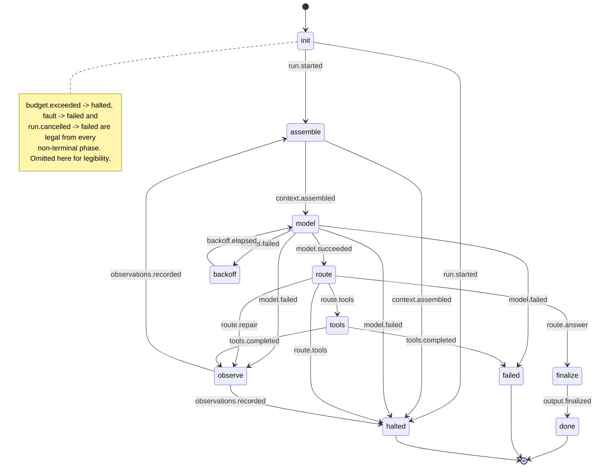

<!-- GENERATED FILE — do not edit.
     Run `npm run diagram`. CI fails if this drifts from src/orchestrator/phases.ts. -->

# The state machine

Generated from `TRANSITIONS` in [`src/orchestrator/phases.ts`](../src/orchestrator/phases.ts),
which is the same table the reducer asserts every transition against
([ADR-0006](adr/0006-table-driven-fsm-pure-reducer.md)). If this diagram is
wrong, the machine is wrong.

## Every transition

| from \ event | backoff.elapsed | budget.exceeded | context.assembled | fault | model.failed | model.succeeded | observations.recorded | output.finalized | route.answer | route.repair | route.tools | run.cancelled | run.started | tools.completed |
| --- | --- | --- | --- | --- | --- | --- | --- | --- | --- | --- | --- | --- | --- | --- |
| **init** | · | halted | · | failed | · | · | · | · | · | · | · | failed | assemble, halted | · |
| **assemble** | · | halted | model, halted | failed | · | · | · | · | · | · | · | failed | · | · |
| **model** | · | halted | · | failed | backoff, observe, failed, halted | route | · | · | · | · | · | failed | · | · |
| **route** | · | halted | · | failed | · | · | · | · | finalize | observe | tools, halted | failed | · | · |
| **tools** | · | halted | · | failed | · | · | · | · | · | · | · | failed | · | observe, failed |
| **observe** | · | halted | · | failed | · | · | assemble, halted | · | · | · | · | failed | · | · |
| **backoff** | model | halted | · | failed | · | · | · | · | · | · | · | failed | · | · |
| **finalize** | · | halted | · | failed | · | · | · | done | · | · | · | failed | · | · |
| **done** | · | · | · | · | · | · | · | · | · | · | · | · | · | · |
| **failed** | · | · | · | · | · | · | · | · | · | · | · | · | · | · |
| **halted** | · | · | · | · | · | · | · | · | · | · | · | · | · | · |

`·` means the phase does not accept that event; attempting it throws
`InvariantViolation` rather than being ignored.

Three events are legal from every non-terminal phase and are omitted from the
diagram above for legibility:

| Event | Goes to | Meaning |
| ----- | ------- | ------- |
| `budget.exceeded` | `halted` | A declared limit was reached. |
| `fault` | `failed` | Something outside the machine broke. |
| `run.cancelled` | `failed` | The caller aborted. |

## Phases

### `init`

Nothing has happened yet.

Accepts: `budget.exceeded`, `fault`, `run.cancelled`, `run.started`

### `assemble`

Building the context window for the next model call.

Accepts: `budget.exceeded`, `fault`, `run.cancelled`, `context.assembled`

### `model`

Waiting on the model.

Accepts: `budget.exceeded`, `fault`, `run.cancelled`, `model.succeeded`, `model.failed`

### `route`

The decision point: tool calls, an answer, or a repair.

Accepts: `budget.exceeded`, `fault`, `run.cancelled`, `route.tools`, `route.answer`, `route.repair`

### `tools`

Executing the tool calls the model asked for.

Accepts: `budget.exceeded`, `fault`, `run.cancelled`, `tools.completed`

### `observe`

Folding results back into the transcript as observations.

Accepts: `budget.exceeded`, `fault`, `run.cancelled`, `observations.recorded`

### `backoff`

Waiting out a transient failure before retrying.

Accepts: `budget.exceeded`, `fault`, `run.cancelled`, `backoff.elapsed`

### `finalize`

Turning a draft answer into the run's output.

Accepts: `budget.exceeded`, `fault`, `run.cancelled`, `output.finalized`

### `done` *(terminal)*

Terminal. Produced an answer.

Accepts: nothing

### `failed` *(terminal)*

Terminal. Gave up; something was wrong.

Accepts: nothing

### `halted` *(terminal)*

Terminal. Hit a declared limit; nothing was wrong.

Accepts: nothing
